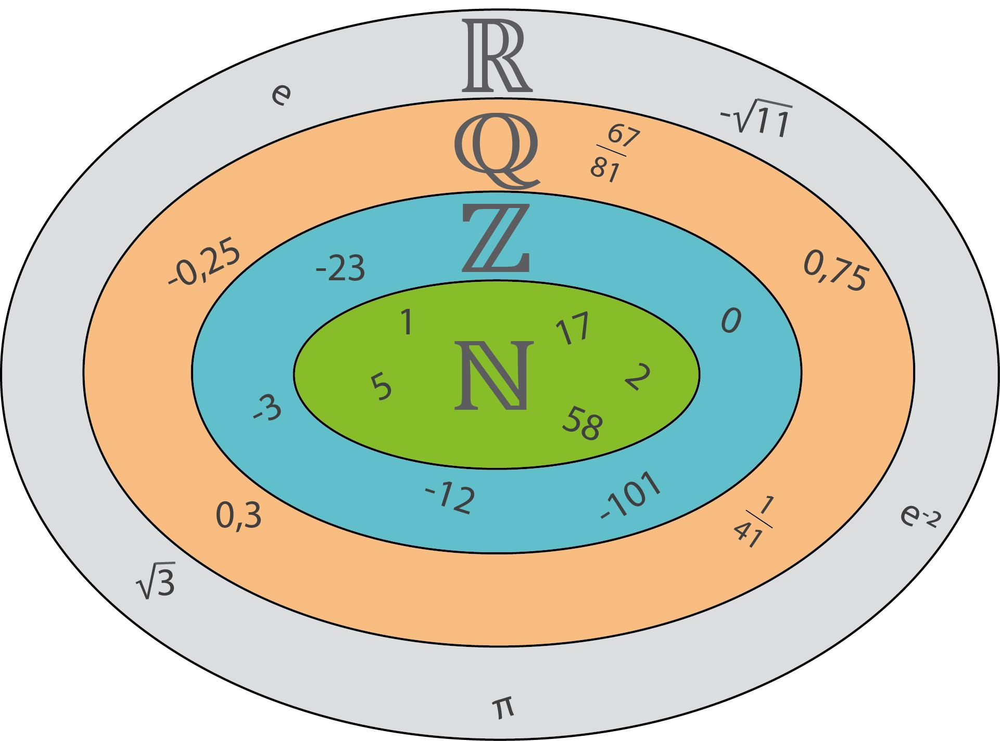
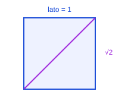
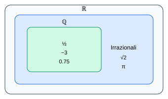
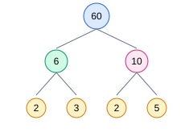

# 🎓 Lezione: Insiemi Numerici

> 💡 Idea: ogni nuovo concetto nasce dalla necessità di **estendere** il precedente

> 🎯 Obiettivo: comprendere come i matematici classificano i numeri attraverso gli **insiemi numerici**.

# 📌 Insieme

> 🤏 Definizione intuitiva: **Insieme** $\triangleq$ collezione di **elementi** con **proprieta'** comuni

## 🚀 Esempio

L'insieme `semi_carte_poker` $\triangleq$ { semi di carte da gioco / usati nel poker } $\triangleq$ { ♥️, ♦️, ♠️, ♣️ } 

* Nome: `semi_carte_poker`
* Simbolo: 🃏
* Definizione: { semi di carte da gioco / usati nel poker }
* Proprieta' comune: semi usati nel `poker`
* Elementi: { ♥️, ♦️, ♠️, ♣️ }

## 🚀 Esempio

L'insieme `lettere_maiuscole` $\triangleq \lbrace ??? \rbrace \triangleq \lbrace ?, ?, ? \rbrace$ 

* Nome: `lettere_maiuscole`
* Simbolo: 🅰
* Definizione: $\lbrace ??? \rbrace$
* Proprieta' comune: ???
* Elementi: $\lbrace ?, ?, ? \rbrace$

## 🚀 Esempio

L'insieme `sport_da_racchetta` ...

> 🤔 Domanda: qual'e' il primo e l'ultimo elemento dell'insieme?

# 📌 Appartenenza ($\in$)

Dato l'insieme `semi_carte_poker` = { ♥️, ♦️, ♠️, ♣️ } 

> 🤔 Domanda: l'elemento ♦️ appartiene all'insieme `semi_carte_poker`?

* ♦️ $\in$ `semi_carte_poker`
* "l'elemento ♦️ appartiene all'insieme `semi_carte_poker`"

> 🤔 Domanda: l'elemento 🗡️ appartiene all'insieme `semi_carte_poker`?

* 🗡️ $\not\in$ `semi_carte_poker`
* "l'elemento 🗡️ **non** appartiene all'insieme `semi_carte_poker`"

# 📌 Uguaglianza

Consideriamo gli insiemi `A` e `B`

$$A = \lbrace1,2,3\rbrace $$
$$B = \lbrace2,3,1\rbrace $$

> 🤔 Domanda: questi due insiemi sono uguali ( $B = A$ )? 

# 📌 Equivalenza (Opzionale)

Consideriamo gli insiemi `A` e `B`

$$A = \lbrace1,2,3\rbrace $$
$$B = \lbrace1,4,9\rbrace $$

> 🤔 Domanda: questi due insiemi sono equivalenti? ( $B \sim A$ )? 

> 🤏 Definizione: due insiemi si dicono `equivalenti` se esiste una 
> corrispondenza biunivoca fra i loro elementi.

$$ A\sim B \iff \exists\ f:A\rightarrow B\ \mid \text{f sia biiettiva}$$

In questo caso $f(x) = x^2$, visto che questa funzione esiste ed e' biiettiva
possiamo dire che $A\sim B$

# 📌 Cardinalita'

> 🤏 Definizione: La `cardinalita'` di un insieme e' il numero di elementi che esso contiene

Per esempio la cardinalita' dell'insieme $A$ = \lbrace1,2,4\rbrace$ vale `3`; formalmente $|A| = 3$.

Mentre $|$ { ♥️, ♦️, ♠️, ♣️ } $| = 4$.

> 🤔 Domanda: quanto vale $|\mathbb N|$ ?

# 📌 Insiemi annidati

Un elemento di un insieme puo' essere a sua volta un insieme; in questo caso si parla di insiemi annidati:

$$A = \lbrace \lbrace 1 \rbrace, \lbrace 2, 3 \rbrace, \lbrace 4, \lbrace 5 \rbrace \rbrace \rbrace$$

> 🤔 Domanda: quanto vale $| A |$ ?

Gli elementi di A sono: `{1}` `{2,3}` `{4,{5}}`

Quindi:

$$ \lbrace1\rbrace\in A $$ $$ \lbrace2,3\rbrace\in A $$ $$ \lbrace4,\lbrace5\rbrace\rbrace\in A. $$

Ma:

$$1\not\in A$$

# 📌 Definizione di insieme

> 💡 Idea: la `definizione` di insiemi omogenei si basa sulle `proprieta' comuni` 
> degli elementi. Questo e' un metodo elegante che permette con una 
> `breve definizione` di definire `insiemi molto grandi` (talvolta `infiniti` $\infty$).

>💡 Idea: ci sono `tanti modi diversi` ed `equivalenti` per definire un insieme 
> (tipicamente piu' una definizione risulta: chiara, non ambigua, precisa e concisa: 
> piu' sara' elegante)

> 🤏 Definizione formale: un `insieme` è una `collezione` (non ordinata) di `oggetti distinti`, detti `elementi`, tale che sia possibile stabilire in modo non ambiguo se un determinato oggetto `appartiene` oppure no all'insieme.

> 🤔 Domanda: queso insieme $A = \lbrace 1, 2, 1\rbrace$ e' ben definito? 

>💡 Idea: posso pensare quindi di definire in modo `estensivo` un insieme elencando uno ad uno i suoi elementi. In questo modo potrei definire anche insiemi `eterogenei`, come:

$$ A = \lbrace 2, gatto, \pi, \triangle \rbrace $$

> 🤔 Domanda: sara' possibile definire insiemi infiniti $\infty$ in questo modo?

# 📌 Definizione induttiva

> 💡 Idea: "_L'insieme dei Numeri Naturali $\mathbb N$ ha origine da `0`; ogni numero naturale possiede 
> un `successore`, ottenuto `aggiungendo 1`_"

$$0\in\mathbb N$$
$$n\in\mathbb N\Rightarrow S(n)\in\mathbb N$$
$$S(n) \triangleq n + 1$$

# 📌 Insiemi numerici

I principali insiemi numerici sono:

| Simbolo | Nome |
|---|---|
| $$\mathbb N$$ | Naturali |
| $$\mathbb Z$$ | Interi |
| $$\mathbb Q$$ | Razionali |
| $$\mathbb R$$ | Reali |

$$
\mathbb{N}\subset\mathbb{Z}\subset\mathbb{Q}\subset\mathbb{R}
$$

> 💡 Idea: Ogni insieme nasce perché il precedente **non è sufficiente** a
> rappresentare tutti i numeri di cui abbiamo bisogno

- I naturali non permettono sempre la sottrazione ($1 - 2$)
- Gli interi non permettono sempre la divisione ($\frac{1}{2}$)
- I razionali non rappresentano tutte le lunghezze ($\pi\ e$)
- I reali completano la retta numerica

# 📌 Numeri naturali ($\mathbb N$)

Nascono in tempi antichi per contare oggetti

$$\mathbb N=\lbrace0,1,2,3,\dots\rbrace$$

## 📚 Rappresentazione

## 📚 Addizione

Consideriamo due numeri naturali $x\in\mathbb N$ e $y\in\mathbb N$ 
(i.e. $x=2,y=4$).

L'operazione di `addizione` si definisce `chiusa` nei numeri naturali in quanto
vale sempre:

$$x+y=z \Rightarrow z\in\mathbb N$$
(qualsiasi numeri naturali siano `x` e `y`, la loro somma `z` sara' anch'essa un numero naturale ("chiuso" nell'insieme $\mathbb N$): $2 + 4 = 6 \in\mathbb N$)

## 📚 Moltiplicazione

Anche la `moltiplicazione` si definisce operazione `chiusa` per lo stesso motivo

$$x\in\mathbb N,\ y\in\mathbb N$$

$$x \times y = z\ \Rightarrow\ z \in\mathbb N$$

## 📚 Sottrazione

> 🤔 Domanda: vale lo stesso per la sottrazione? sara' anch'essa operazione `chiusa` in $\mathbb N$? Fai un esempio

# 📌 Numeri interi ($\mathbb Z$)

> 💡 Idea: nasce l'esigenza di definire un insieme contenente numeri negativi

Come rappresentare debiti, temperature sotto zero e differenze negative?

## 📚 Rappresentazione

$$
\mathbb Z \triangleq \lbrace\dots,-3,-2,-1,0,1,2,3,\dots\rbrace
$$

## 📚 Simmetria

## 📚 Addizione e moltiplicazione

> 🤔 Domanda: possiamo affermare che le proprieta' delle operazioni che valgono per l'insieme dei numeri naturali $\mathbb N$ valgono anche per l'insieme $\mathbb Z$ ma non vice versa? Perche'?

## 📚 Numeri opposti

Due numeri sono opposti se la loro somma è zero.

$$
(+5)+(-5)=0
$$

## 🚀 Esercizi

1. Ordina: $$-2,\;4,\;-7,\;1$$
2. Calcola $$-6+9$$
3. Trova l'opposto di $$13$$

> 💡 Idea: ora possiamo parlare della distanza da zero.

## 📚 Valore assoluto

Il valore assoluto di un numero ($|x|$) e' definito come la distanza del numero da `0` (`origine`).

(Equivale a considerare il numero sempre di segno positivo `+`) 

(Equivale a moltiplicare il numero per il suo stesso segno (annullondolo))

$$
|x|=
\begin{cases}
x & x\ge0\\
-x & x<0
\end{cases}
$$

Vale sempre la proprieta':

$$x \in\mathbb Z$$
$$|x| \ge 0$$

Il valore assoluto e' molto utile per misurare la distanza fra due punti 
(qualsiasi siano i loro segni):

$$
|a-b|=\text{distanza tra }a\text{ e }b
$$

## 🚀 Esercizi

* $|10| = ?$
* $|+10| = ?$
* $|-10| = ?$
* $|-123| = ?$
* $|+123| = ?$
* $|(-10) - (+2)| = ?$
* Risolvi $|x|=4$

## 📚 Sottrazione

Nell'insieme dei numeri interi la `sottrazione` si definisce operazione `chiusa` 

$$x\in\mathbb Z,\ y\in\mathbb Z$$

$$x - y = z\ \Rightarrow\ z \in\mathbb Z$$

## 📚 Divisione

> 🤔 Domanda: vale lo stesso per la divisione? Sara' anch'essa operazione `chiusa` in $\mathbb Z$? Fai un esempio

# 📌 Numeri razionali ($\mathbb Q$)

> 💡 Idea: nasce l'esigenza di definire un insieme contenente i numeri con la virgola

Come rappresentare metà pizza o tre quarti di litro?

>🤏 Definizione: Un `numero razionale` è un rapporto tra due interi

$$\mathbb Q \triangleq \lbrace \frac{a}{b},\ \forall\ a \in\mathbb Z, b \in\mathbb Z, b \not = 0 \rbrace$$

## 📚 Frazioni equivalenti

Due frazioni $\frac{a}{b}, \frac{c}{d}$ si dicono equivalenti se vale: $a\cdot d = c\cdot b$

$$\frac12=\frac24=\frac36$$

## 🚀 Esempi

$$\frac34+\frac14=1$$
$$\frac25\times\frac53=\frac23$$

## 📚 Numeri decimali

Ogni razionale possiede uno sviluppo decimale finito oppure periodico.

## 🚀 Esempio

Un numero razionale ha varie rappresentazioni (tutte equivalenti):

$$5 / 10 = \frac{5}{10} = \frac{1}{2} = 0.5$$

## 🚀 Esempio

Posso sempre convertire una rappresentazione di un numero razionale in un'altra:

$$\frac18=1 / 8 = 0.125$$
$$0.75=75 / 100 = \frac{75}{100} = \frac34$$

## 🚀 Esercizi

* Semplifica $\frac{18}{24}$
* Confronta $\frac35$ e $\frac47$
* Verifica l'equivalenza tra $\frac23$ e $\frac46$
* Trasforma $0.4$ in frazione
* Scrivi in decimale $\frac58$
* Riconosci il tipo di $2.13\overline5$

## 📚 Divisione

Nell'insieme dei numeri razionali la `divisione` si definisce operazione `chiusa` per 
definizione dell'insieme

$$x\in\mathbb Q,\ y\in\mathbb Q, y\not=0$$

$$x / y = z\ \Rightarrow\ z \in\mathbb Q$$

> 💡 Idea: non abbiamo altre esigenze? l'insieme $\mathbb Q$ basta da solo a racchiudere ogni 
> numero esistente? 

## 📚 Numeri periodici

> 💡 Idea:  un numero e' razionale **se e solo se** il suo sviluppo decimale e' 
> **finito** oppure **periodico**

$$ 10 / 3 = \frac{10}{3} = 3.3333333333... = 3.\overline{3}$$

* Un numero si dice `periodico` se ha un periodo, una sequenza di cifre, che si ripetono all'infinito dopo la virgola
* Per esempio $34.1234343434343... = 34.12\ 34\ 34\ 34\ 34\ 34 ...$ ha periodo `34` e si indica con $34.12\overline{34}$
* Un numero si dice `periodico semplice` se il periodo inizia subito dopo la virgola $3.333333...=3.\overline{3}$
* Un numero di dice `periodico misto` se ci sono delle cifre fra la virgola e il periodo (dette `antiperiodo`) $$0.4123123123123 = 0.4 \ 123 \ 123 \ 123 \ 123 = 0.4\overline{123}$$

> Cosa pensi di numeri come $\pi$, $\sqrt{2}$, $e$, ...

# 📌 Numeri irrazionali ($\mathbb I$)

> Numeri come $\pi$, $\sqrt{2}$ ed $e$ hanno infinite cifre decimali, 
> ma **non presentano alcun periodo**: per questo motivo **non** sono 
> numeri razionali e appartengono all'insieme dei **numeri irrazionali**

$$\pi,\ \sqrt{2},\ e\ \dots \not\in\mathbb Q$$
$$\mathbb Q \cap \mathbb I=\empty$$

> 💡 Idea: non tutti i numeri si possono costruire tramite una frazione,
> esistono lunghezze che nessuna frazione può rappresentare

## 🚀 Esempio

Consideriamo un quadrato di lato 1

Per il Teorema di Pitagora la sua diagonale vale 

$$d^2=1^2+1^2$$
$$d=\sqrt2$$

Lo sviluppo decimale di $\sqrt2$ e' inifinito non periodico

$$
1.414213562\dots
$$

## 🚀 Esercizi

* Spiega perché $\sqrt2$ non è razionale
* Classifica $\pi$
* Classifica $0.1010010001\dots$

# 📌 Numeri reali ($\mathbb R$)

L'insieme dei reali contiene tutti i razionali e tutti gli irrazionali.

$$
\mathbb R=\mathbb Q\cup \mathbb I
$$

> 💡 Idea: La `retta reale` è continua, ogni punto corrisponde a un numero reale

# 📌 Proprieta' delle operazioni

## 📚 Commutativa

> 🤏 Definizione: un'operazione gode della proprietà commutativa se, scambiando 
> l'ordine degli operandi, il risultato non cambia

$$a+b=b+a$$
$$a\cdot b=b\cdot a$$

## 📚 Associativa

> 🤏 Definizione: un'operazione gode della proprietà associativa se, cambiando 
> il modo in cui gli operandi vengono raggruppati, il risultato non cambia

$$(a+b)+c=a+(b+c)$$

## 📚 Distributiva

> 🤏 Definizione: la moltiplicazione è distributiva rispetto all'addizione e 
> alla sottrazione quando può essere applicata separatamente a ciascun termine 
> contenuto nelle parentesi

$$a(b+c)=ab+ac$$

## 📚 Priorità

1. Parentesi
2. Potenze
3. Moltiplicazioni e divisioni
4. Addizioni e sottrazioni

> 🤔 Domanda: calcola: 

$$3+4\times(5-2)^2$$

# 📌 Potenze

> 🤏 Idea: $a^n=\underbrace{a\cdot a\cdot\dots\cdot a}_{n\ volte}$ dove $a$ si dice `base` ed $n$ si dice `esponente`

## 📚 Proprietà

* $a^0 = 1\ (a\not=0)$
* $a^{-n} = \frac{1}{a^n}\ (a\not=0)$
* `prodotto` $a^m\cdot a^n=a^{m+n}$
* `quoziente` $\frac{a^m}{a^n}=a^{m-n}$
* `potenza di potenza` $(a^m)^n=a^{mn}$
* `potenza del prodotto` $(ab)^n=a^nb^n$

## 🚀 Esercizi

1. $2^5$ = ?
2. $3^2\cdot3^4$ = ?
3. $(2^3)^2$ = ?

# 📌 Multipli, divisori e numeri primi

## 📚 Divisibilità

> 🤏 Definizione: un numero $a$ è `divisibile` per $b$ se esiste un intero $$k$$ tale che $a=bk$

## 📚 Numeri primi

> 🤏 Definizione: un `numero primo` è un `numero naturale` maggiore di 1 che possiede esattamente due divisori positivi distinti: 1 e se' stesso

I numeri primi fino a 30:

$$
2,3,5,7,11,13,17,19,23,29
$$

Criteri essenziali:

| Numero | Criterio |
|---|---|
| 2 | ultima cifra pari |
| 3 | somma cifre multipla di 3 |
| 5 | termina con 0 o 5 |
| 9 | somma cifre multipla di 9 |

## 🚀 Esercizi

1. 147 e' divisibile per 3?
2. 250 e' divisibile per 5?
3. 37 è primo?

# 📌 Scomposizione in fattori primi

> 🤏 Definizione - Teorema fondamentale: ogni numero naturale maggiore di 1 si `scompone` in modo unico `come prodotto di numeri primi`

## 📚 Albero dei fattori

Quindi

$$60=2^2\cdot3\cdot5$$

## 🚀 Esercizi

* Scomponi 36 in fattori primi
* Scomponi 84 in fattori primi
* Scrivi 180 in `forma canonica` (fattori primi `ordinati` in ordine crescente)

## 📚 Forma canonica

> 🤏 Definizione: la forma canonica di un numero naturale $n>1$ è la sua scomposizione in fattori primi, 
> nella quale i fattori primi sono raccolti in potenze e ordinati in senso crescente.

$$n = p_1^{\alpha_1} \cdot p_2^{\alpha_2} \cdot p_3^{\alpha_3} \cdot ... = \Pi_i{p_i^{\alpha_i}}$$
$$p_1​<p_2​< ... <p_k​$$

# 📌 Massimo Comune Divisore (`MCD`)

> 🤏 Definizione: e' il più grande divisore comune tra due numeri

Per trovarlo:
1. Scomponiamo in fattori primi i due numeri
2. Consideriamo solo gli `esponenti minimi` dei `fattori primi in comune`

$$24=2^3\cdot3$$
$$36=2^2\cdot3^2$$
$$MCD=2^2\cdot3=12$$

## 🚀 Esercizi

* MCD(18, 30)
* MCD(42, 56)
* MCD(45, 75)

# 📌 Minimo Comune Multiplo (mcm)

> 🤏 Definizione: e' il più piccolo multiplo comune tra due numeri

Per trovarlo:
1. Scomponiamo in fattori primi i due numeri
2. Consideriamo tutti i fattori primi con `massimi esponenti`

$$24=2^3\cdot3$$
$$36=2^2\cdot3^2$$
$$mcm(24, 36) = 2^3\cdot3^2=72$$

## 🚀 Esercizi

1. mcm(8,12)
2. mcm(15,20)
3. mcm(18,30)

# 📌 Rapporti, proporzioni e percentuali

> 🤏 Definizione: un `rapporto` e' il `quoziente` tra due
> grandezze

$$a:b=\frac ab$$

> 🤏 Definizione: una `proporzione` e' un'uguaglianza fra 
> rapporti

$$a:b=c:d$$

> Dove vale la `proprietà fondamentale`: $ad=bc$

## 🚀 Esempio

$$2:5=8:20$$
$$\frac{2}{5}=\frac{8}{20}$$
$$20\cdot\frac{2}{5}=20\cdot\frac{8}{20}$$
$$\frac{20\cdot2}{5}=\frac{8}{1}$$
$$5\cdot\frac{20\cdot2}{5}=5\cdot\frac{8}{1}$$
$$2\cdot20=5\cdot8$$

## 📚 Percentuale

Una percentuale rappresenta una frazione su 100

$$p\%=\frac p{100}$$

Se applico una percentuale ad un numero ottengo una parte 
(i.e. 20% di sconto del prezzo (59.99 €))

$$\text{Parte}=\frac p{100}\times\text{Totale}$$
$$\text{Parte}=\frac {20}{100}\times\text{59.99}$$
$$\text{Parte}=0.2 \cdot 59.99$$

## 🚀 Esempio

Il 20% di 80 vale:

$$\frac{20}{100}\times80=16$$

## 🚀 Esercizi

* Trova il 15% di 200
* Risolvi la proporzione $3:4=x:20$
* Calcola lo sconto del 25% su 60 €

# 📌 Riepilogo

Abbiamo imparato che:

* un `insieme` è una collezione di elementi che condividono determinate proprietà
* gli elementi possono `appartenere` oppure `non appartenere` a un insieme
* due insiemi sono `uguali` se contengono esattamente gli stessi elementi, indipendentemente dall'ordine
* due insiemi sono `equivalenti` se esiste una corrispondenza biunivoca tra i loro elementi
* la `cardinalità` di un insieme indica il numero dei suoi elementi
* un insieme può contenere a sua volta altri `insiemi` come elementi
* un insieme può essere definito in modo `estensivo`, elencandone gli elementi, oppure attraverso le `proprietà` che li caratterizzano
* una `definizione induttiva` permette di costruire un insieme specificando un elemento iniziale e una regola per ottenere i successivi
* i principali `insiemi numerici` sono $\mathbb N$, $\mathbb Z$, $\mathbb Q$ e $\mathbb R$
* vale la relazione:
  $$\mathbb N\subset\mathbb Z\subset\mathbb Q\subset\mathbb R$$
* i `numeri naturali` $\mathbb N$ permettono di rappresentare quantità intere non negative e sono chiusi rispetto ad addizione e moltiplicazione
* i `numeri interi` $\mathbb Z$ estendono i naturali introducendo anche i numeri negativi
* due numeri interi sono `opposti` se la loro somma è zero
* il `valore assoluto` $|x|$ rappresenta la distanza del numero $x$ dall'origine:
  $$|x|\ge0$$
* nei numeri interi la sottrazione è un'operazione `chiusa`, mentre la divisione non lo è
* i `numeri razionali` $\mathbb Q$ sono numeri esprimibili come rapporto tra due interi, con denominatore diverso da zero:
  $$\mathbb Q=\left\lbrace\frac ab\mid a,b\in\mathbb Z,\ b\not=0\right\rbrace$$
* un numero razionale può essere rappresentato come `frazione`, `frazione equivalente` oppure `numero decimale`
* lo sviluppo decimale di un numero razionale è `finito` oppure `periodico`
* i `numeri irrazionali` $\mathbb I$ sono numeri reali che non possono essere espressi come rapporto tra due interi e hanno sviluppo decimale infinito non periodico
* esempi di numeri irrazionali sono $\pi$, $\sqrt2$ ed $e$
* i `numeri reali` $\mathbb R$ comprendono sia i razionali sia gli irrazionali:
  $$\mathbb R=\mathbb Q\cup\mathbb I$$
* la `retta reale` è continua e ogni suo punto corrisponde a un numero reale
* le principali proprietà delle operazioni sono `commutativa`, `associativa` e `distributiva`
* nelle espressioni aritmetiche bisogna rispettare le `priorità`:

  1. Parentesi
  2. Potenze
  3. Moltiplicazioni e divisioni
  4. Addizioni e sottrazioni
* una `potenza` rappresenta una moltiplicazione ripetuta dello stesso fattore:
  $$a^n=\underbrace{a\cdot a\cdot\dots\cdot a}_{n\ volte}$$
* le potenze rispettano proprietà specifiche per `prodotto`, `quoziente`, `potenza di potenza` e `potenza del prodotto`
* un numero è `divisibile` per un altro se può essere scritto come loro prodotto:
  $$a=bk$$
* un `numero primo` è un numero naturale maggiore di 1 che possiede esattamente due divisori positivi distinti: 1 e se stesso
* ogni numero naturale maggiore di 1 può essere scomposto in modo unico come `prodotto di numeri primi`
* la `forma canonica` raccoglie i fattori primi in potenze e li ordina in senso crescente
* il `MCD` è il più grande divisore comune tra due o più numeri
* per calcolare il MCD tramite la scomposizione in fattori primi si prendono i fattori comuni con `esponente minimo`
* il `mcm` è il più piccolo multiplo comune tra due o più numeri
* per calcolare il mcm tramite la scomposizione in fattori primi si prendono tutti i fattori con `esponente massimo`
* un `rapporto` è il quoziente tra due grandezze:
  $$a:b=\frac ab$$
* una `proporzione` è un'uguaglianza tra rapporti:
  $$a:b=c:d$$
* in una proporzione vale la `proprietà fondamentale`:
  $$ad=bc$$
* una `percentuale` rappresenta una frazione con denominatore 100:
  $$p\%=\frac p{100}$$

> 💡 Idea: gli insiemi numerici nascono progressivamente per **estendere** ciò che possiamo rappresentare e calcolare.

$$
\boxed{
\mathbb N\subset\mathbb Z\subset\mathbb Q\subset\mathbb R
}
$$

Ogni estensione risponde a una nuova esigenza:

$$
\mathbb N
\xrightarrow{\text{sottrazione}}
\mathbb Z
\xrightarrow{\text{divisione}}
\mathbb Q
\xrightarrow{\text{numeri irrazionali}}
\mathbb R
$$
