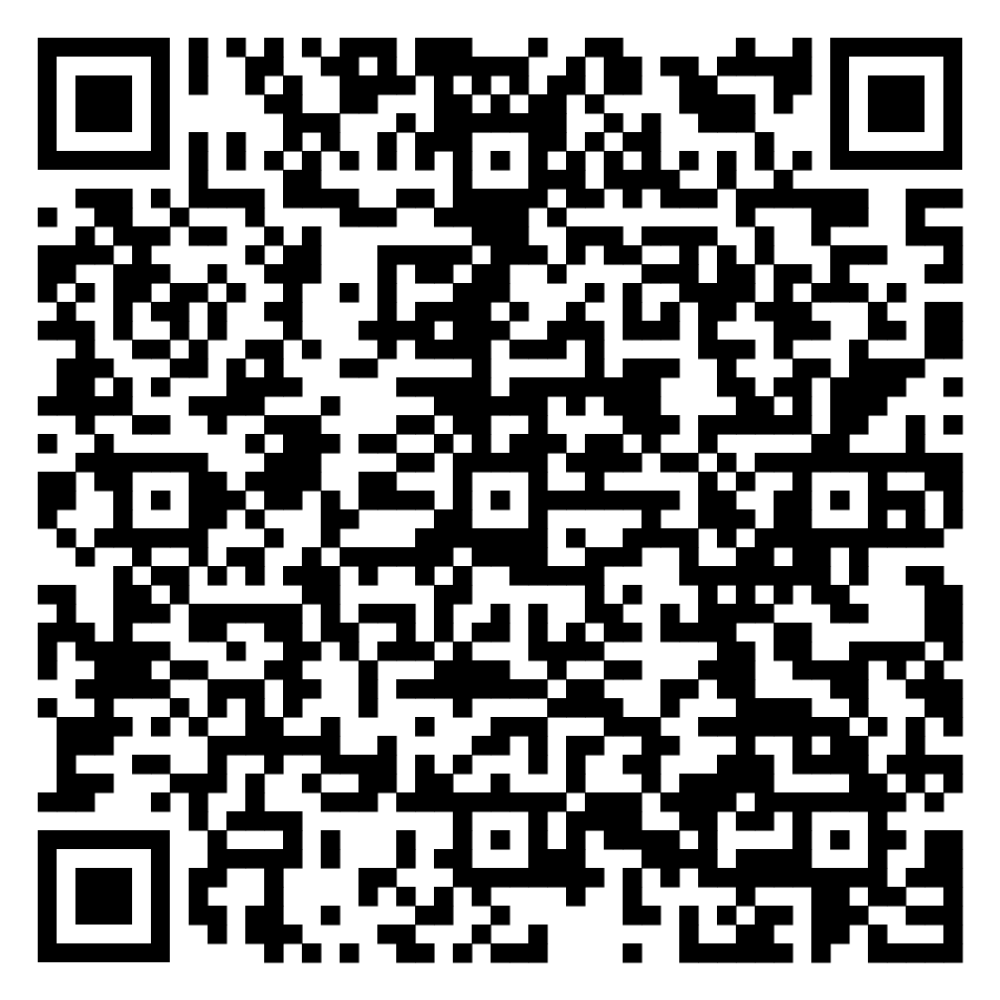

# Corso di Matematica - Prima Superiore - Liceo Scientifico

## Link

## Calendario

| Data ora aula                 | Lezione                           | Note                                              |
|:--                            |:--                                |:--                                                |
| 02/09/26 08:00 - 09:40 1LsaB  | Matematica                        | Insieme, insiemi numerici                         |
| 03/09/26 08:00 - 09:40 1LsaB  | Matematica                        | Polinomi                                          |
| 04/09/26 08:00 - 09:40 1LsaB  | Matematica                        | Equazioni                                         |
| 08/09/26 10:45 - 12:25 1LsaB  | Matematica                        | Frazioni algebriche                               |
| 09/09/26 10:45 - 12:25 1LsaB  | Matematica                        | La geometria del piano                            |

## Syllabus

1. Insiemi numerici
    * Le operazioni con i numeri naturali, interi, razionali
    * Proprietà delle potenze
2. Polinomi
    * Addizione, sottrazione, moltiplicazione di polinomi
    * Prodotti notevoli: quadrato di binomio, somma per differenza, quadrato di trinomio, cubo di binomio
    * Scomposizione in fattori mediante raccoglimento totale e parziale, prodotti notevoli, trinomio particolare (solo caso 1)
3. Equazioni
    * Risoluzione equazioni lineari
    * Equazioni determinate, indeterminate, impossibili
    * Formule inverse
4. Frazioni algebriche
    * Definizione e condizioni di esistenza
    * Semplificazione
    * Operazioni
    * Risoluzione di equazioni fratte
5. Geometria del piano
    * Mediane, altezze, bisettrici, assi
    * Teorema di Pitagora
    * Definizione e caratteristiche di parallelogrammi, rombi, rettangoli, quadrati, trapezi
